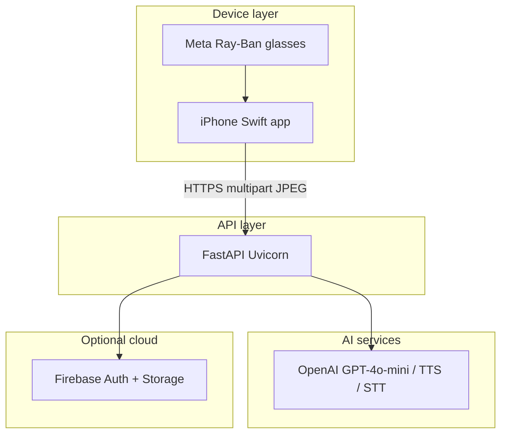

<p align="center">
  <strong>RayCast AI</strong><br/>
  Multimodal AI assistant for Meta Ray-Ban smart glasses — real-time scene understanding and spoken guidance.
</p>

---

## Table of contents

- [Overview](#overview)
- [Architecture](#architecture)
- [Repository layout](#repository-layout)
- [Prerequisites](#prerequisites)
- [Quick start](#quick-start)
- [Configuration](#configuration)
- [Backend (FastAPI)](#backend-fastapi)
- [Clients](#clients)
  - [Swift / iOS (primary)](#swift--ios-primary)
  - [Expo / React Native](#expo--react-native)
  - [Next.js web](#nextjs-web)
- [API surface](#api-surface)
- [Key implementation details](#key-implementation-details)
- [Testing](#testing)
- [Troubleshooting](#troubleshooting)
- [Development workflow](#development-workflow)
- [Documentation](#documentation)
- [Contributing](#contributing)
- [License and third-party notices](#license-and-third-party-notices)

---

## Overview

RayCast AI connects **Meta Ray-Ban (Gen 2)** smart glasses to a **Python [FastAPI](https://fastapi.tiangolo.com/)** backend. The wearer’s camera stream is sampled on an **iPhone**, frames are sent to the cloud, and **OpenAI** models produce:

- A structured **scene description** (JSON: objects, text in scene, summary, uncertainties).
- **Spoken guidance** (MP3 via OpenAI TTS), played back through the glasses.

**Primary client:** native **Swift** app using Meta’s **Device Access Toolkit (DAT)** — live streaming, task modes, and Talk mode.

**Secondary:** **Expo** app for video-upload demos; **Next.js** app for hosting **Apple App Site Association** (universal links).

---

## Architecture



**Live analyze path (`POST /analyze-stream`):**

1. Optional **frame-diff** (OpenCV perceptual hash) — skip if the scene looks unchanged.
2. **Single multimodal call** (`perceive_and_reason`) — vision + task-specific reasoning in one JSON response.
3. **Semantic delta** (`thefuzz`) — skip TTS if the new scene matches the previous one closely.
4. **TTS** (`tts-1`) — Base64 MP3 in the JSON response.
5. **Session memory** (last five turns per `session_id`) conditions the next request.

**Talk path (`POST /chat`):** optional frames → `scene_description` (vision-only JSON) → `chat` (text + memory) → TTS.

Authenticated **video upload** flows (`/analyze-video`, chunk sessions) use **FFmpeg** extraction, STT, and **Firebase Storage** under user-scoped paths.

---

## Repository layout

```
RayCast-AI/
├── backend/raycast-mvp/          # FastAPI server — start here for the API
│   ├── app/
│   │   ├── main.py               # Routes, CORS, lifespan
│   │   ├── models/schemas.py     # Pydantic models
│   │   └── services/
│   │       ├── reasoning.py      # perceive_and_reason, chat, task prompts, memory hooks
│   │       ├── memory.py         # Rolling session memory (5 turns, 30 min TTL)
│   │       ├── delta.py          # Frame hash + fuzzy scene_changed
│   │       ├── vision.py         # extract_frames, scene_description
│   │       ├── tts.py            # OpenAI speech
│   │       ├── audio.py          # FFmpeg + STT
│   │       ├── storage.py        # Lazy Firebase init
│   │       ├── session.py        # Chunk-session registry (auth flows)
│   │       ├── auth.py           # Firebase ID token verification
│   │       ├── config.py         # OpenAI client, env
│   │       └── video.py          # Video splitting
│   ├── tests/                    # pytest + fixtures
│   ├── requirements.txt
│   └── readme.md                 # Detailed API tables (duplicate of interest: endpoint reference)
├── apps/
│   ├── swift-mobile/             # PRIMARY: Xcode, Meta DAT, live stream
│   ├── mobile/                   # Expo Router, video upload to /analyze-video
│   ├── web/                      # Next.js, .well-known for iOS universal links
│   └── mobile-test/              # Meta CameraAccess-style sample / testing
└── docs/                         # Project documentation (e.g. capstone report)
```

---

## Prerequisites

| Component | Notes |
|-----------|--------|
| **Python** | 3.10+ recommended for `backend/raycast-mvp` |
| **FFmpeg** | On `PATH` or set `FFMPEG_PATH` — required for video/audio pipelines |
| **Node.js** | 18+ for Expo and Next.js apps |
| **Xcode** | Latest stable, for `swift-mobile` on a **physical iPhone** |
| **Meta developer setup** | Meta AI app, Developer Mode, Wearables Developer Center project (App ID, client token, URL scheme) |
| **OpenAI API key** | Required for any AI route |

---

## Quick start

### 1. Backend

```bash
cd backend/raycast-mvp
python3 -m venv venv
source venv/bin/activate          # Windows: venv\Scripts\activate
pip install -r requirements.txt
cp .env.example .env
# Edit .env: set OPENAI_API_KEY at minimum
mkdir -p outputs
python -m uvicorn app.main:server --reload --host 0.0.0.0 --port 8000
```

- Health: `curl http://127.0.0.1:8000/health`
- Interactive docs: `http://127.0.0.0:8000/docs` (custom HTML)

### 2. Swift app (glasses demo)

```bash
open apps/swift-mobile/CameraAccess.xcodeproj
```

- Select the **RayCastAI** scheme, a **physical device**, and your signing team.
- Set **`BACKEND_URL`** in `CameraAccess/Info.plist` to `http://<your-LAN-IP>:8000` or an **HTTPS** tunnel URL (ngrok, etc.) reachable from the phone.
- Build and run; use the in-app flow to connect glasses per Meta documentation.

### 3. Expo app (optional)

```bash
cd apps/mobile
npm install
npx expo start
```

Set `EXPO_PUBLIC_RAYCAST_API_BASE_URL` or `EXPO_PUBLIC_LAN_IP` as needed (see `constants/api.ts`).

---

## Configuration

### Backend `.env` (`backend/raycast-mvp/.env`)

| Variable | Required for | Description |
|----------|----------------|-------------|
| `OPENAI_API_KEY` | AI routes | OpenAI API key (`sk-...`) |
| `FIREBASE_BUCKET` | Storage uploads | Firebase Storage bucket name |
| `FFMPEG_PATH` | Video flows | Full path to `ffmpeg` if not on `PATH` |
| `FIREBASE_CREDENTIALS_PATH` / `GOOGLE_APPLICATION_CREDENTIALS` | Storage | Path to service account JSON |
| `PORT` | Server | Listen port (default `8000`) |

Firebase credential files are commonly named `firebase-key.json` in the project root (gitignored). **`/analyze-stream` and `/chat` do not require Firebase** if you only exercise the AI path.

### Swift `Info.plist`

- **`BACKEND_URL`**: Base URL of the API, no trailing slash (e.g. `https://abc123.ngrok.io`).

### Expo

- **`EXPO_PUBLIC_RAYCAST_API_BASE_URL`**: Override full API base URL.
- **`EXPO_PUBLIC_LAN_IP`**: Host IP when not using override (see `apps/mobile/constants/api.ts`).

---

## Backend (FastAPI)

Full endpoint tables, Context Packet schema, Firebase path layout, and limits are documented in:

**[backend/raycast-mvp/readme.md](backend/raycast-mvp/readme.md)**

Highlights:

| Category | Examples |
|----------|----------|
| Public | `GET /`, `GET /health`, `GET /docs`, `POST /analyze-stream`, `POST /chat`, `GET /mock` |
| Auth (Bearer Firebase ID token) | `POST /analyze-video`, `POST /session/start`, `POST /analyze-chunk`, `/storage/*`, `GET /me` |

**Tech stack:** FastAPI, Uvicorn, Pydantic v2, OpenAI Python SDK, OpenCV (headless), NumPy, thefuzz, firebase-admin.

---

## Clients

### Swift / iOS (primary)

| Item | Detail |
|------|--------|
| Project | `apps/swift-mobile/CameraAccess.xcodeproj` |
| Target | RayCast AI (`com.thelenslink.raycastai`) |
| Streaming | `StreamSession`: raw codec, low resolution, 24 fps |
| Analysis loop | Every **5 s**, **6** JPEG samples from a **120**-frame ring buffer → `POST /analyze-stream` |
| Talk mode | `general` task mode; speech → `POST /chat` |
| Find Object | Optional `search_query` form field from dashboard text field |

Further Meta pairing notes: **[apps/swift-mobile/README.md](apps/swift-mobile/README.md)**

### Expo / React Native

- **Role:** Secondary client; **Live** tab uploads a video file to **`POST /analyze-video`** (not the live multipart stream).
- **Entry:** Expo Router under `apps/mobile/app/`.
- **Wearables:** Native module when using dev client; see `apps/mobile/docs/IOS-META-SETUP.md` if applicable.

### Next.js web

- Minimal **Next.js 16** app under `apps/web`.
- **`vercel.json`:** serves `/.well-known/apple-app-site-association` for **iOS Universal Links** (bundle id `com.thelenslink.raycastai` in `public/.well-known/`).

---

## API surface

### `POST /analyze-stream` (multipart)

| Field | Type | Notes |
|-------|------|--------|
| `task_mode` | string | `chess`, `navigate`, `findObject`, `readText`, `describe`, `general` |
| `session_id` | string | Stable id per app session (memory + delta key) |
| `frames` | files | 1–12 JPEGs, each &gt; 100 bytes |
| `search_query` | string, optional | Used when `task_mode=findObject` |

**Response:** `StreamAnalysisResponse` — `changed`, optional `scene`, `analysis_text`, optional `audio_base64` (Base64 MP3).

### `POST /chat` (multipart)

| Field | Type |
|-------|------|
| `user_text` | string |
| `session_id` | string |
| `frames` | optional JPEG files |

**Response:** `ChatResponse` — `response_text`, optional `audio_base64`.

---

## Key implementation details

| Concern | Location |
|---------|----------|
| Unified multimodal JSON | `app/services/reasoning.py` — `perceive_and_reason` |
| Session memory | `app/services/memory.py` — max 5 turns, stale purge |
| Fast skip before LLM | `app/services/delta.py` — `frames_look_same` |
| Skip TTS after LLM | `app/services/delta.py` — `scene_changed` |
| Lazy Firebase | `app/services/storage.py` — `_get_bucket()` |
| Non-blocking OpenAI | `app/main.py` — `asyncio.to_thread(...)` |
| Chunk sessions (auth) | `app/services/session.py` — separate from live `session_id` strings |

---

## Testing

```bash
cd backend/raycast-mvp
source venv/bin/activate
./venv/bin/python3 -m pytest tests/test_optimized_pipeline.py tests/test_memory.py -v
```

OpenAI is **mocked** in tests; no network required. Optional live prompt checks: `tests/test_real_prompt.py` (requires API keys). Benchmark script: `tests/benchmark_pipeline.py`.

---

## Troubleshooting

| Symptom | Things to check |
|---------|------------------|
| `401` / invalid key | `OPENAI_API_KEY` in `.env`, no quotes issues |
| Firebase error on **upload** routes | `firebase-key.json` or env path; `FIREBASE_BUCKET` |
| Swift cannot reach API | Same Wi-Fi, firewall, `BACKEND_URL` uses machine-reachable host; use HTTPS tunnel for device |
| Always `changed: false` | Expected when scene static (frame-diff / delta working) |
| Uvicorn hangs on import | Usually resolved by lazy Firebase; ensure no blocking import path |

---

## Development workflow

- **Integration branch:** `dev` — merge target for features.
- **Feature branches:** Name by owner and scope (e.g. `kevin/feat/optimize-reasoning-agent`).
- **Stacked PRs:** Dependent changes may target another feature branch until the first merges.
- **Secrets:** Never commit `.env`, `firebase-key.json`, or API keys. Use `.gitignore` and rotate keys if exposed.

---

## Documentation

| Document | Content |
|----------|---------|
| [backend/raycast-mvp/readme.md](backend/raycast-mvp/readme.md) | API reference, limits, Firebase tree, setup |
| [apps/swift-mobile/README.md](apps/swift-mobile/README.md) | Xcode, bundle ID, Meta registration |
| [docs/CIS4914_RayCast_AI_Senior_Project_Report.md](docs/CIS4914_RayCast_AI_Senior_Project_Report.md) | Academic project report (UF CIS 4914) |

---

## Contributing

1. Fork or branch from `dev`.
2. Run backend tests before opening a PR.
3. Keep commits focused; document env or API changes in this README or `backend/raycast-mvp/readme.md`.
4. For Meta / Apple identifiers, do not commit secrets — use placeholders in docs.

---

## Team

| Name | Focus |
|------|--------|
| Kai McFarlane | Lead, integration, streaming, audio |
| Charles James Jr. | Backend, Firebase, infrastructure |
| Michael Mwaura | Expo / frontend |
| Hoang Tran | AI pipeline, optimization, testing |

---

<p align="center">
  Built with FastAPI · OpenAI · Meta Wearables · Swift · Expo
</p>
